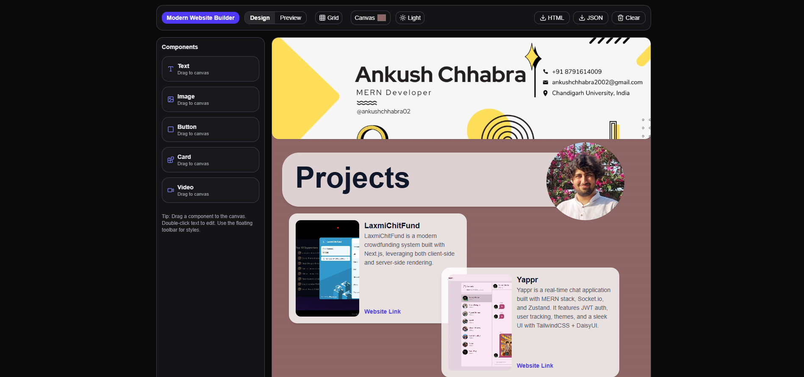
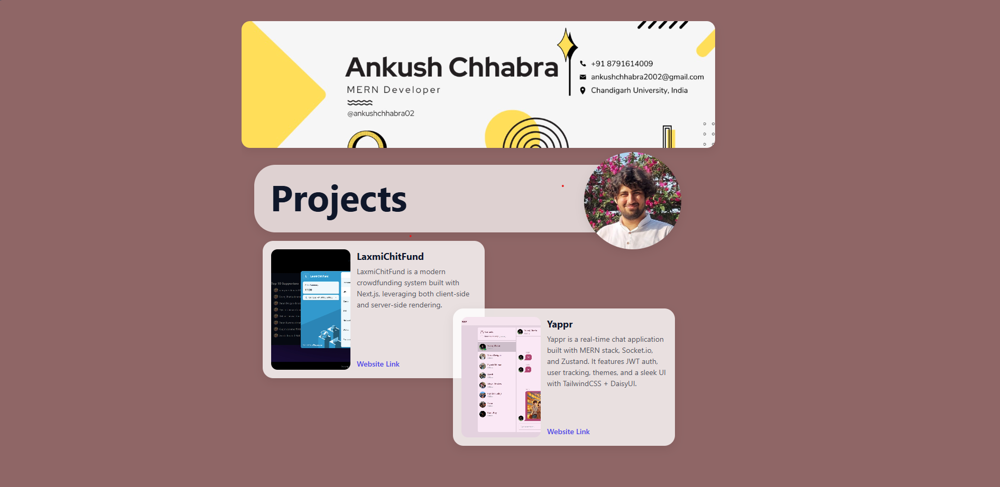

## Modern WYSIWYG Website Builder

A simple web-based WYSIWYG (What You See Is What You Get) web page builder inspired by WordPress and Wix. The builder should allow users to create a basic web page layout by dragging and dropping components, editing text, and previewing the final layout.

## Features

- Drag & drop blocks: Text, Image, Button, Card, Video
- Move/resize with snap‑to‑grid and corner handles
- Contextual floating toolbar (radius, color, shadow, etc.)
- Rich text editing via Lexical with Bold / Italic / Underline
- Canvas background color, grid overlay toggle, dark/light toggle
- Preview mode (locked) vs Design mode (editable)
- Export to HTML (self-contained styling) and JSON
- Autosave to localStorage; Clear resets the canvas

## Tech stack

- Next.js 15 (App Router) + React 19
- Tailwind CSS v4 (class-based dark mode)
- react-dnd + HTML5 backend (drag & drop)
- Custom draggable/resizable (React 19–safe) using pointer events
- Lexical Editor (@lexical/react + nodes) for text editing and HTML in/out
- lucide-react for icons

## Quick start

Prerequisites: Node.js 18+

```bash
npm install
npm run dev
```

Open http://localhost:3000.

## How to use

- Drag a component from the left toolbox onto the canvas
- Select a block to move/resize; use the corner handles to resize
- For Text blocks: double‑click to edit; use B / I / U in the floating toolbar above the item
- Use the floating toolbar to tweak props (radius, background, shadow, colors, etc.)
- Top bar: Design/Preview, Grid toggle, Canvas background, Dark/Light, Export HTML/JSON, Clear

## Export notes

- Exported HTML centers the canvas and sizes it to the furthest items
- Minimal CSS reset included to avoid text spacing and heading defaults
- Text preserves white-space and line-height for visual parity
- Images: uploaded files are embedded as data URLs; external URLs referenced as-is
- YouTube/Vimeo links normalized to embed URLs

## Persistence

- Autosaves to localStorage under key: `modern-builder-v1`
- “Clear” removes items and selection

## Scripts

```bash
# Dev (Turbopack)
npm run dev

# Production build
npm run build

# Start production server
npm start
```

## Known limits / ideas

- Text formatting limited to Bold/Italic/Underline
- Absolute positioning by design; responsive behavior is manual
- No groups/multi-select yet; no external webfont packaging in export

## Demo

Here’s a preview of Modern Website Builder:

1. Website
   

2. Exported HTML Example
   
